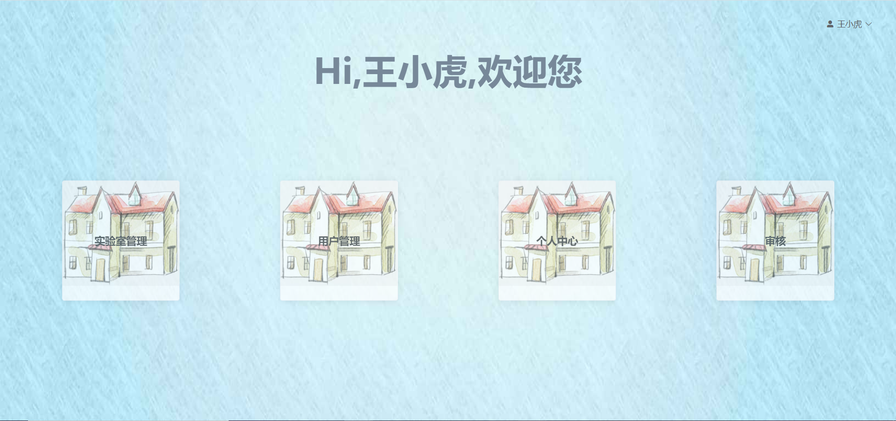
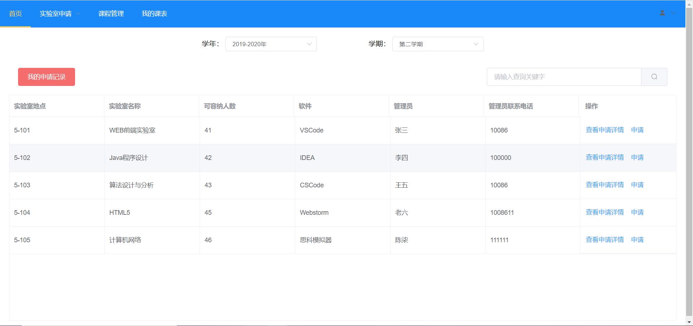
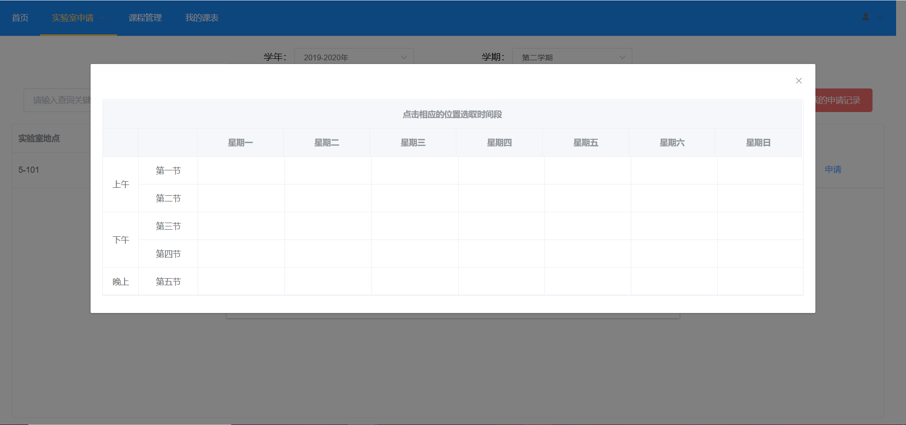
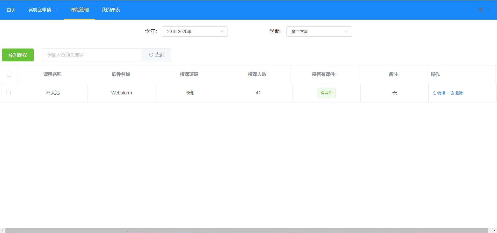
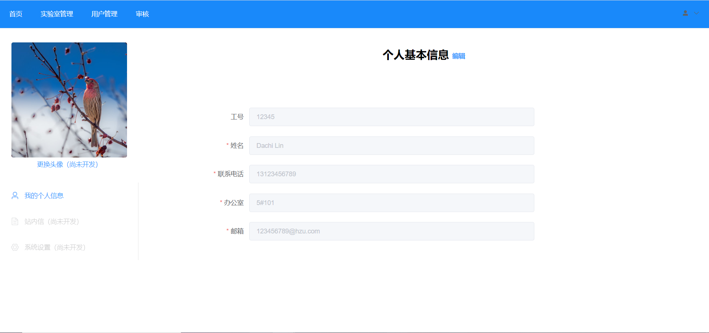
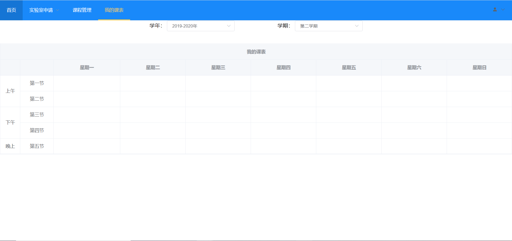
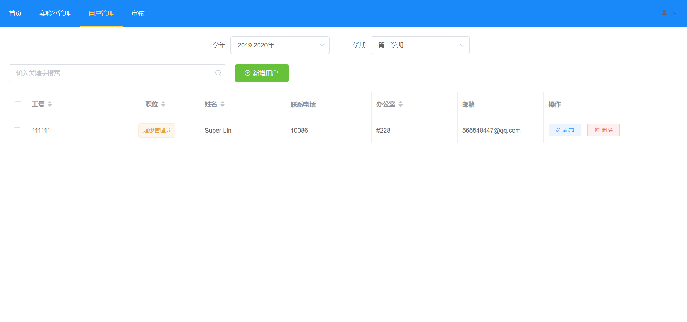
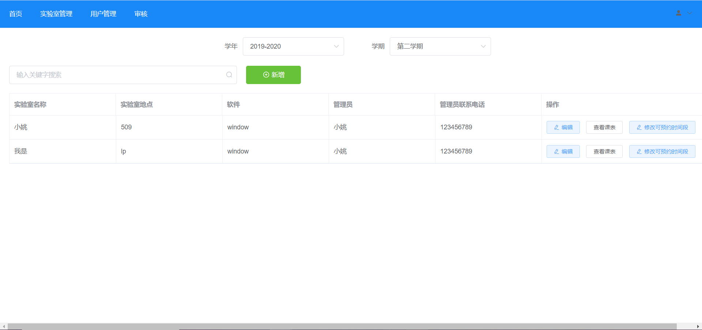

# 实验室预约系统
该系统主要是实现一个师生预约实验室，管理员和超级管理员审批的大功能，可分为用户模块，课程模块，实验   室模块，权限模块，课表模块6个模块。
## 相关图片展示
### 1、超级管理员、管理员、老师各自的主页显示
教师主页：
  
管理员主页：
  
超级管理员主页

### 各角色相关功能的大致介绍
#### 1、Teacher
- 实验室申请  
  

- 课程管理

- 个人中心 

- 我的课表

### SupManager
- 用户管理

- 实验室管理

- 审核实验室（未审核）

- 审核实验室（已审核）

- 个人中心

### Manager
管理员可分担超级管理员的部分业务，也拥有审核实验室预约和小部分实验室管理的权限。由于部分权限尚未设置，在此先不做展示；

